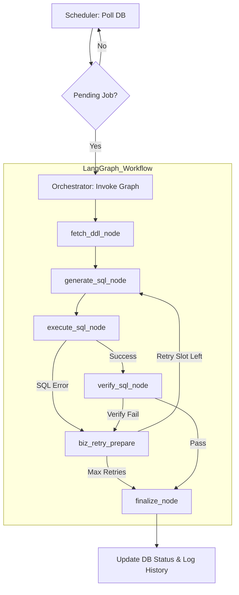

# 🚀 AI 기반 Oracle 데이터 마이그레이션 에이전트 (LangGraph Edition)

Oracle DB의 매핑 룰 테이블(`NEXT_MIG_INFO`)을 스마트하게 폴링하여, **LangGraph** 기반의 상태 머신이 DDL/DML/검증 SQL을 자동 생성하고 실행·검증·자율 교정하는 자율형 마이그레이션 에이전트입니다.

---

## ✨ 핵심 기능

- **LangGraph 기반 자율 오케스트레이션**: 고정된 선형 파이프라인이 아닌, 상태(State)와 조건부 루프를 활용하여 에러 발생 시 스스로 판단하고 SQL을 교정하는 지능형 워크플로우를 가집니다.
- **자동 SQL 생성 (D3 Strategy)**: LLM이 컬럼 매핑 정보와 소스 DDL을 바탕으로 **D**DL(테이블 생성), **D**ML(데이터 이관), **D**ata Verification(정합성 검증) 3종 SQL을 원샷으로 생성합니다.
- **Self-Healing 기술**: SQL 실행이나 검증 단계에서 실패할 경우, Oracle 에러 메시지를 다시 그래프의 입력으로 넣어 성공할 때까지 최대 3회 자율 교정을 시도합니다.
- **실시간 정합성 검증**: 이관 직후 원본과 타겟의 데이터를 비교하는 검증 SQL을 실행하여 `DIFF=0`인 경우에만 `PASS` 판정을 내립니다.
- **스케줄 기반 자동화**: APScheduler를 통해 10초 주기로 DB 작업 대기열을 감시합니다.

---

## 🏗️ 시스템 아키텍처



---

## 📂 프로젝트 구조

```text
migration-main/
├── requirements.txt              # LangGraph, LangChain 포함 의존성
├── app/
│   ├── main.py                   # 시스템 진입점 (APScheduler)
│   ├── agent/
│   │   ├── graph.py              # [CORE] LangGraph 워크플로우 정의 (Nodes & Edges)
│   │   ├── state.py              # [CORE] 마이그레이션 상태(TypedDict) 정의
│   │   ├── orchestrator.py       # 그래프 실행 및 전체 관리
│   │   ├── llm_client.py         # LLM 연동 (Gemini/OpenAI 호환)
│   │   ├── executor.py           # Oracle DB SQL 실행기
│   │   ├── verifier.py           # 데이터 정합성 검증 엔진
│   │   └── sql_utils.py          # SQL 파싱 및 전처리
│   ├── core/
│   │   ├── db.py                 # Oracle 접속 관리 (Thin/Thick 지원)
│   │   ├── logger.py             # UTF-8 기반 멀티플랫폼 로깅
│   │   └── exceptions.py         # 에이전트 전용 예외 처리
│   └── domain/
│       ├── mapping/              # 매핑 규칙 모델 및 Repository
│       └── history/              # 마이그레이션 이력 관리
```

---

## ⚙️ 설치 및 설정

### 1. 의존성 설치
```bash
pip install -r migration-main/requirements.txt
```

**핵심 기술 스택**
- **LangGraph**: 상태 기반 워크플로우 엔진
- **python-oracledb**: Oracle 연동 (11g ~ 23c 지원)
- **OpenAI SDK**: Gemini-2.5-Flash 등 LLM 연동
- **APScheduler**: 백그라운드 작업 폴링

### 2. 환경 변수 (`.env`)
```env
# LLM 설정
OPEN_API_KEY=your_api_key
LLM_MODEL=gemini-2.5-flash-lite
LLM_BASE_URL=https://generativelanguage.googleapis.com/v1beta/openai/

# Oracle DB 설정
DB_USER=scott
DB_PASS=tiger
DB_HOST=localhost
DB_PORT=1521
DB_SID=xe
ORACLE_CLIENT_PATH=C:\oraclexe\app\oracle\product\11.2.0\server\bin
```

---

## 🚀 실행 방법

```bash
cd migration-main
python -m app.main
```

**실행 로그 예시:**
```text
2026-04-20 11:01:45,508 - [JOB_START] 대상 작업(map_id=1) 프로세스 시작 (LangGraph)
2026-04-20 11:01:46,082 - [Graph:DDL] EMPLOYEES 컬럼 11개 조회 완료
2026-04-20 11:01:46,084 - [Graph:LLM] Attempt 1/3 | SQL 생성 요청
2026-04-20 11:01:50,615 - [Graph:VERIFY] 데이터 정합성 검증 시작
2026-04-20 11:01:51,034 - [Graph:FINISH] map_id=1 | >>> 성공 <<<
2026-04-20 11:01:51,035 - [JOB_DONE] map_id=1 | 최종 상태: PASS | 소요시간: 4초
```

---

## ⚠️ 주의 사항

- **자율 재시도**: 에러가 발생하면 그래프가 스스로 `biz_retry_prepare` 노드를 거쳐 SQL을 수정합니다. 최대 3회 실패 시 자동으로 `FAIL` 처리됩니다.
- **Thin/Thick 모드**: Oracle 11g와 같은 구버전 환경에서는 `ORACLE_CLIENT_PATH`를 설정하여 Thick 모드로 동작해야 할 수 있습니다.
- **재실행**: 이미 처리된 작업(`USE_YN='N'`)을 다시 실행하려면 해당 룰의 `USE_YN`을 다시 `'Y'`로 수동 업데이트해야 합니다.
